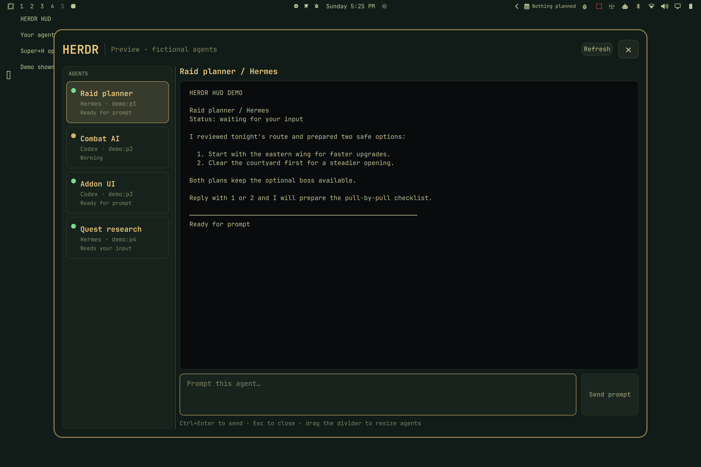

# Herdr HUD for Omarchy

Herdr HUD keeps your [Herdr](https://herdr.dev/) agents inside your game. A small draggable **H** button stays above fullscreen apps; click it or use a keybind to open a larger terminal and prompt panel without minimizing the game.



## Features

- See every connected agent, its agent type, workspace title, pane, and live status.
- Read live terminal output that follows the newest response automatically.
- Prompt ready agents without switching windows.
- Green attention badge for blocked agents and unseen status changes.
- Drag the H button anywhere; its position is saved separately for each monitor.
- Drag the roster divider to give the terminal more room.
- Works over any fullscreen Wayland app, including games.

## Requirements

- Omarchy Quattro with `omarchy-shell`
- [Herdr](https://herdr.dev/) installed and available as `herdr`
- Python 3 (included with Omarchy)

The panel shows a setup message when Herdr is missing or unavailable.

## Install

```bash
omarchy plugin add https://github.com/finna/omarchy-herdr-hud.git --enable
```

The H button appears immediately. Click it to open the panel.

To add a keyboard shortcut, put this in `~/.config/hypr/bindings.lua` using any free chord:

```lua
o.bind("SUPER + H", "Toggle Herdr HUD", "omarchy-shell shell toggle finna.herdr-hud '{}'")
```

Then reload Hyprland with `hyprctl reload`. Omarchy keeps keybind choice in user config so this plugin does not overwrite an existing shortcut.

## Use

- **Click H:** open or close the panel on that monitor.
- **Drag H:** reposition the button.
- **Click an agent:** select its terminal and clear its unread indicator.
- **Ctrl+Enter:** send the current prompt.
- **Esc:** close the panel.
- **Drag the vertical divider:** resize the agent roster.

State is stored in `~/.config/herdr-hud/state.json`.

## Update and remove

```bash
omarchy plugin update finna.herdr-hud
omarchy plugin remove finna.herdr-hud
```

Removal unloads the plugin and deletes its checkout. To also remove saved UI preferences:

```bash
rm -rf ~/.config/herdr-hud
```

## Development

```bash
omarchy plugin validate .
python -m unittest discover -s tests -v
```

The QML UI uses Omarchy's plugin lifecycle and Quickshell layer surfaces. `bin/herdr-hud` is a standard-library-only bridge that invokes Herdr with argument arrays, rechecks the selected agent before prompting, and never evaluates prompt text in a shell.

Herdr HUD is a community project and is not affiliated with Herdr or Basecamp.
